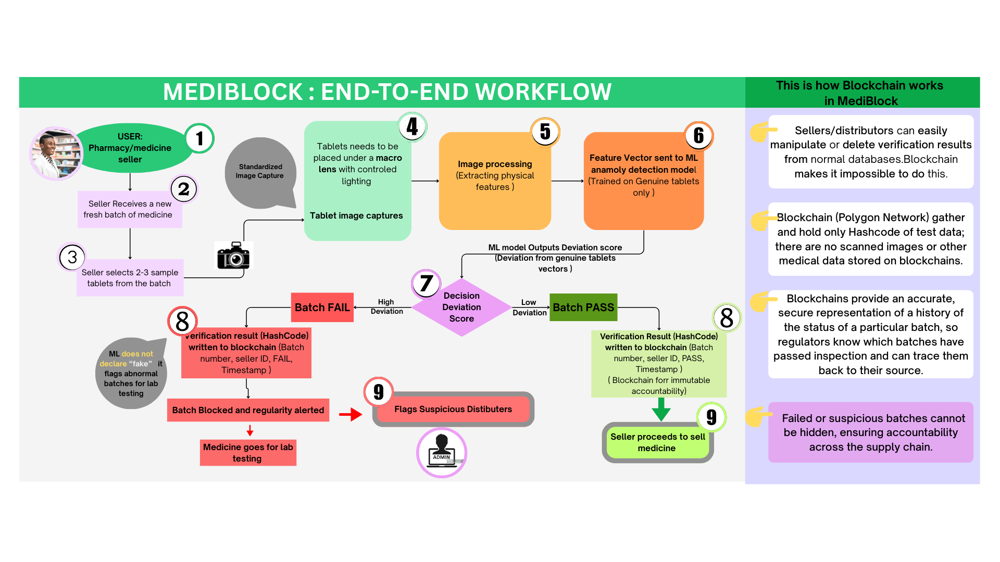

# 💊 MediBlock: Stopping Fake Medicine at the Source

> **"We are shifting the fight against counterfeit medicine from verifying the packaging (which is easily faked) to verifying the actual tablet (which is chemically and physically unique) using B2B industrial verification."**

---

## 1. 🌍 The Silent Global Crisis (The Problem)

**The scale of this problem is terrifying.**
Counterfeit medicines are not just a "scam"—they are a public health disaster. The World Health Organization estimates that **1 in 10 medical products** in developing nations is substandard or falsified.

### This leads to:

* ☠️ **Treatment Failure:** Patients take antibiotics that contain just chalk, allowing infections to kill them.
* 🦠 **Superbugs:** Medicines with incorrect dosages accelerate global drug resistance.
* 💔 **Erosion of Trust:** When a mother cannot trust the syrup she gives her child, the entire healthcare system collapses.

### Why haven't we solved it yet?
Current solutions are fighting the wrong battle. They focus on **Packaging Verification** (QR codes, Holograms, Barcodes).

* **The Flaw:** A printer can copy a QR code. A sticker factory can clone a hologram. If the packaging is faked well, the fake pill inside passes undetected.
* **The Gap:** There is currently no scalable way to verify the physical pill itself without destroying it in a lab, which takes days and costs a fortune.

**MediBlock fills this gap. We verify the product, not the packet.**

---

## 2. 💡 The MediBlock Solution

MediBlock is a physical verification system designed for **Distributors and Pharmacies**. It allows them to scan a sample of tablets from an incoming batch to instantly verify their authenticity.

We use **Macro-Computer Vision** to extract a unique **"Physical Fingerprint"** from the tablet's surface—features like microscopic texture and edge roughness that are artifacts of the manufacturer's specific industrial molds. These cannot be cloned by cheap counterfeit presses.

We then anchor these results on the **Polygon Blockchain** to ensure that once a batch fails, no corrupt distributor can "delete" the failure from the records.

---

## 3. ⚙️ How It Works: The Full Workflow

The system follows a strict industrial pipeline: **Capture $\rightarrow$ Extract $\rightarrow$ Verify $\rightarrow$ Immutable Log**.

Below is the complete architectural flow of the system, showing how the Seller, the AI Engine, and the Blockchain interact.

  

---

## 4. 🧠 Deep Dive: The Machine Learning "Brain"

We do not use standard "Cat vs. Dog" classification, because we don't know what every future fake pill will look like. Instead, we use **Anomaly Detection**.

  

### The Logic

We took a different path than most AI projects. Instead of "Binary Classification" (training on Real vs. Fake), which fails because you can't predict what a future fake will look like, we used **Unsupervised Anomaly Detection**.

We teach the AI **only** what a genuine tablet looks like. Anything that doesn't match that specific pattern is automatically rejected.

### Phase 1: The "Vision" (Feature Extraction)

Before the AI can make a decision, we have to turn the physical tablet into data. We use Macro-Computer Vision to extract a 4-dimensional "Physical Fingerprint" based on four specific vectors:

#### 1. Texture (T) → The "Skin" Check

* **The Logic:** Genuine tablets are compressed under massive industrial pressure, creating a specific, consistent surface grain. Fakes often use cheaper binders (like chalk), making them either too smooth (plastic-like) or too dusty.
* **The Math:** We use the **GLCM (Gray-Level Co-occurrence Matrix)** to calculate Contrast. This gives us a numerical score for the microscopic "roughness" of the surface.

#### 2. Edge Roughness (E) → The "Cut" Check

* **The Logic:** A factory mold creates a perfect, smooth edge. A cheap counterfeit press often leaves jagged, chipped, or uneven edges.
* **The Math:** **Radial Variance**. We measure the distance from the center of the tablet to the edge at 360 different points. If these distances vary wildly, the edge is jagged (Anomaly). If they are consistent, it is smooth (Genuine).

#### 3. Imprint Depth (D) → The "Stamp" Check

* **The Logic:** Official manufacturers use heavy steel punches to stamp logos. This creates a deep, sharp relief. Fakes usually have shallow, "soft" imprints because their machines lack the necessary force.
* **The Math:** **Sobel Gradient Magnitude**. We calculate the intensity of the shadows inside the logo. Darker, sharper shadows = deeper imprint.

#### 4. Coating Uniformity (C) → The "Finish" Check

* **The Logic:** Real pills are coated in high-tech rotating drums for a perfectly even finish. Fakes are often hand-sprayed, leading to blotches or uneven reflection.
* **The Math:** **Histogram Deviation**. We measure the standard deviation of pixel brightness. A low deviation means the color is uniform; high deviation means it is patchy.

### Phase 2: The "Brain" (One-Class SVM)

Once we extract these four numbers, we feed them into our model.

* **Why One-Class SVM?** We don't have samples of every fake drug in the world. One-Class SVM is perfect here because it learns from only positive examples.

* **The "Sphere of Trust":** During training, the model plots hundreds of genuine tablet vectors in 4D space. It then draws a tight mathematical boundary (a hypersphere) around them.
    * **Inside the Sphere:** The tablet is accepted as **Genuine**.
    * **Outside the Sphere:** The tablet is rejected as an **Anomaly**.
    

  

---

## 5. 🔗 Deep Dive: The Blockchain "Trust Anchor"

### 1. The Necessity: Preventing Internal Fraud

We integrated blockchain technology to address a critical vulnerability known as the **"Inside Job."**

In traditional databases (like SQL), a corrupt administrator or warehouse manager has the power to simply delete a "Failed Inspection" record to slip a bad batch into the market. Blockchain removes this "Delete Button." 

By utilizing a decentralized ledger, we ensure that once a batch is flagged as an anomaly, that record becomes immutable history that no one—not even us—can erase.

### 2. The Architecture: Hybrid Storage Strategy
To ensure the system is fast enough for industrial use, we use a "Hybrid" approach:

* **Off-Chain (Firebase):** We store the "heavy" data—such as high-resolution tablet images and detailed logs—in a standard cloud database for instant retrieval.

* **On-Chain (The Seal):** We generate a **SHA-256 Hash** (a unique digital fingerprint) of the report and anchor *only* this string to the blockchain.

* **The Tamper-Proof Mechanism:** This links the two worlds. If a malicious actor tries to swap a "Fake" image for a "Real" one in the cloud database, the file's hash changes. The system immediately detects that the Cloud Hash no longer matches the immutable Blockchain Hash, instantly exposing the tampering.

### 3. Infrastructure: Why Polygon (Matic)?

We selected the **Polygon Network** over the Ethereum Mainnet for two strategic reasons:

* **Throughput:** Industrial supply chains require speed. Polygon confirms transactions in seconds, preventing bottlenecks at the distribution center.

* **Economic Viability:** Ethereum gas fees are too volatile for high-volume logistics. Polygon allows us to process thousands of verifications for pennies, making the business model sustainable for distributors.

  

---

## 6. 🔮 Roadmap: Round 2 Improvements

Our immediate goal is to transition MediBlock from a functional prototype to a scalable, field-ready solution. We have identified three critical evolutions for our "Version 2.0" launch:

### 1. Hardware Evolution: The "Optical Chamber"

* **The Challenge:** Relying on manual photography introduces variables—sunlight, shadows, or angle shifts can confuse the current model.

* **The Solution:** We are prototyping a closed-loop, 3D-printed capture unit.
    * **Automation:** Integrated with a mechanical hopper mechanism to auto-feed tablets, boosting throughput to over **50 units per minute**.
    * **Consistency:** Equipped with a fixed internal LED array (diffused lighting) to guarantee that every single input image has identical lighting conditions, completely removing environmental noise.

### 2. Host our Model

* Make our project fully Functional with host link.

### 3. AI Upgrade: Convolutional Autoencoders

* **The Challenge:** While the current One-Class SVM is robust, it relies on manual feature extraction which may miss subtle, non-linear patterns in highly sophisticated fakes.

* **The Solution:** We are migrating to **Deep Learning (Unsupervised Autoencoders)**.

    * **How it works:** The network learns to compress and perfectly reconstruct images of genuine tablets.
    
    * **The Logic:** When a fake is scanned, the network fails to reconstruct it accurately, resulting in a high **"Reconstruction Error."** This metric becomes our new, highly sensitive threshold for spotting anomalies.

---

## 7. 🛠️ Tech Stack

| Component | Technology |
| :--- | :--- |
| **Core** | Python, OpenCV (Computer Vision), Scikit-Learn (ML) |

| **Blockchain** | Polygon (Matic), Solidity, Web3.py |

| **Backend** | Firebase (Realtime DB), Flask |

| **Frontend** | React.js (Dashboard) |

| **Hardware** | Macro Lens, Custom Lighting Rig |

---

  
Made with ❤️ for a Safer World

