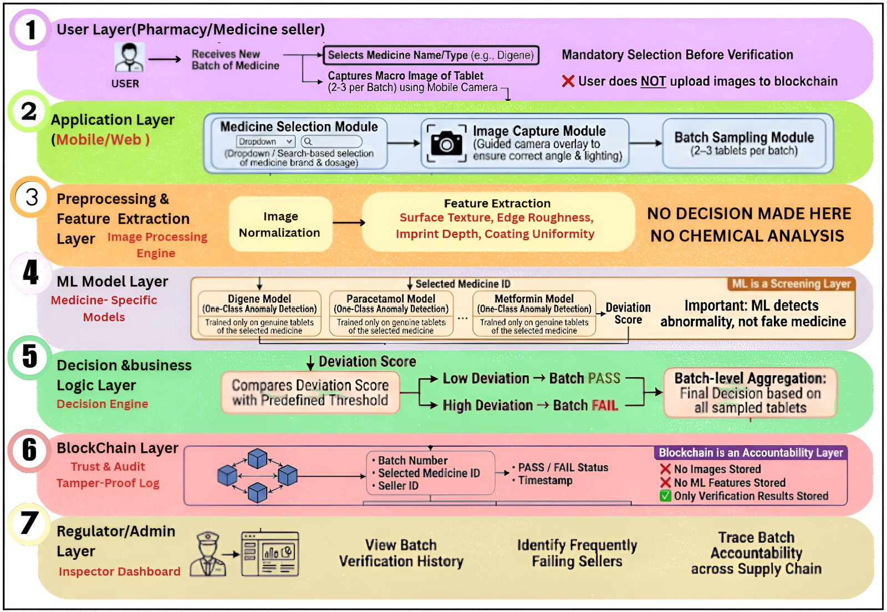
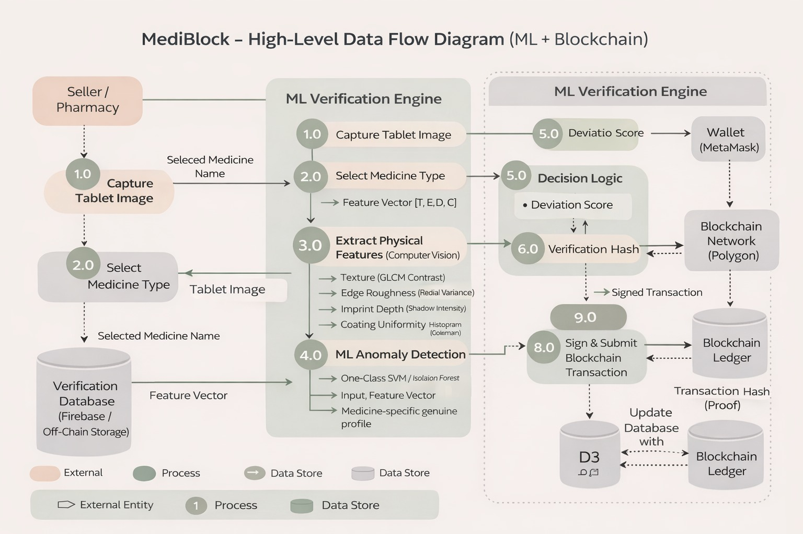

# 💊 MediBlock — Round 2

### Batch-Level Fake Medicine Prevention using Physical Fingerprints & Blockchain

> **"We verify the pill itself, not just the packaging. And we make sure nobody can hide the results."**

---

## 📌 Project Status (Round 2)

**Stage:** Advanced system design + validated ML & blockchain architecture  
**Focus:** Scalability, accountability, medicine-specific ML, and production-ready data flow  
**Audience:** Distributors, pharmacies, regulators (B2B only)

---

## 1️⃣ Problem Statement

Counterfeit medicines remain one of the most dangerous and unsolved public-health threats.

According to WHO, **~10% of medicines in developing regions are substandard or falsified**, leading to:

* Treatment failure and preventable deaths
* Accelerated antimicrobial resistance
* Complete erosion of trust in healthcare supply chains

### Why existing solutions fail

Current systems focus on **packaging verification**:

* QR codes, holograms, barcodes
* Easily copied by counterfeiters
* Verify *labels*, not the *medicine*

**The real issue:** Package security relies on copying information (like a password), which counterfeiters can replicate cheaply. Physical tablet properties require expensive manufacturing equipment that counterfeiters typically can't afford.

### The Core Gap

There is **no scalable, non-destructive, batch-level method** to verify the *physical tablet itself* before it reaches patients — with permanent accountability.

---

## 2️⃣ Proposed Solution — MediBlock

**MediBlock** is a **seller-side verification system** that allows pharmacies and distributors to:

1. Scan **2–3 tablets per batch**
2. Extract a **physical fingerprint** using macro-computer vision
3. Detect **abnormal deviation** using medicine-specific anomaly detection models
4. **Permanently log the verification result on blockchain**

**Why 2-3 tablets?** This follows the same sampling approach that pharmaceutical quality control already uses (called acceptance sampling). It balances thorough checking with practical speed.

This ensures:

* Early detection at the seller/distributor level
* No deletion or manipulation of failed results
* Data-driven regulatory inspection

---

## 3️⃣ System Overview (Round-2 Architecture)

### High-Level System Architecture



*This diagram shows how data flows from the seller through ML processing to blockchain anchoring. Notice how heavy data (images, vectors) stays off-chain while critical decisions (PASS/FAIL) go on-chain.*

---

## 4️⃣ End-to-End Data Flow (DFD)

### 4.1 Complete System Workflow


**External Entity**

* Pharmacy / Distributor (Seller)

**Core Processes**

1. Capture tablet image (macro camera)
2. Mandatory medicine selection (e.g., Digene, Paracetamol)
3. Physical feature extraction
4. ML anomaly detection
5. Decision logic (PASS / FAIL)
6. Blockchain anchoring

**Data Stores**

* Off-Chain Verification Database (Firebase)
* On-Chain Blockchain Ledger (Polygon)

**Our design logic:** Heavy processing (images, ML) stays off-chain for speed. Critical decisions (PASS/FAIL) go on-chain for permanent records. This separation keeps costs low while maintaining trust.

---

### 4.2 High-Level Data Flow Diagram



This shows the interaction between different system components - from the seller's pharmacy all the way to the blockchain ledger and back to the database.

---

### 4.3 Layered System Architecture


**System Layers**

1. **User Layer** — Pharmacy / Seller
2. **Application Layer** — Mobile/Web Interface
3. **Preprocessing & Feature Extraction Layer** — Image Processing Engine
4. **ML Model Layer** — Medicine-specific anomaly detection
5. **Decision & Business Logic Layer** — Batch aggregation and threshold comparison
6. **Blockchain Layer** — Immutable audit log (Polygon Network)
7. **Regulator/Admin Layer** — Inspector Dashboard for monitoring

---

## 5️⃣ Machine Learning Design (Round-2)

### 5.1 Why Anomaly Detection (Not Classification)

We **do not** classify "Real vs Fake".

Reason:

* Future fake medicines are unknown
* Fake manufacturers constantly change techniques

Instead, MediBlock learns **only genuine tablets** and flags **anything abnormal**.

**How this works conceptually:**

Think of it like drawing a boundary around all genuine tablets. We train the model by showing it lots of real tablets, and it learns where the "normal zone" is. During verification, if a tablet falls outside this zone, it gets flagged.

| Approach | What You Need | What It Catches | Future-Proof? |
|----------|---------------|-----------------|---------------|
| Classification (Real/Fake) | Both real AND fake samples | Only fakes you've seen before | No - new fakes slip through |
| **Anomaly Detection** | **Only real samples** | **Anything unusual** | **Yes - catches new fakes automatically** |

This approach makes the system:

* Future-proof against new counterfeiting methods
* Data-efficient (we only need genuine tablets for training)
* Realistic for real-world deployment

---

### 5.2 Complete ML Workflow


The diagram above shows our complete machine learning pipeline from training to deployment. Notice how we:
- Train only on genuine tablets
- Deploy a model that learns what "normal" looks like
- Flag anything that deviates from this learned pattern

---

### 5.3 Physical Fingerprint Extraction (Vision → Data)

Each tablet image is converted into a **4-dimensional numeric fingerprint**:

| Feature                    | What It Measures          | How We Extract It           |
| -------------------------- | ------------------------- | --------------------------- |
| **Texture (T)**            | Surface grain consistency | GLCM Contrast               |
| **Edge Roughness (E)**     | Mold precision            | Radial Variance             |
| **Imprint Depth (D)**      | Logo/text sharpness       | Gradient / Shadow Intensity |
| **Coating Uniformity (C)** | Coating quality           | Histogram Deviation         |

**Output Example Vector:**
`[0.82, 0.91, 0.76, 0.88]`

📌 *No manual labeling needed.*
All values are **automatically computed from the image**.

---

### 5.4 Feature Extraction Process


*This shows how we convert a raw tablet image into a 4-dimensional numeric vector. Each feature (T, E, D, C) captures a different physical property that's hard for counterfeiters to replicate.*

---

#### **Why These Features Work**

Each feature maps to something that's physically hard for counterfeiters to replicate:

**1. Texture (Surface Consistency):**

We measure how uniform the tablet surface is using something called GLCM (Gray-Level Co-occurrence Matrix). It looks at how neighboring pixels relate to each other.

**Basic idea:**
```
Check pairs of nearby pixels → 
If surface is smooth (genuine), pairs are similar → Low contrast score
If surface is rough (fake), pairs vary a lot → High contrast score
```

**Why fakes can't match this:** Genuine pharmaceutical molds create perfectly consistent surfaces through precision compression. Counterfeit operations using cheaper equipment leave irregular grain patterns that our algorithm picks up.

---

**2. Edge Roughness (Die-Cutting Precision):**

We check how round or smooth the tablet edge is by measuring distances from the center to the edge at different angles.

**Simple version:**
```
Take measurements all around the edge →
Calculate how much they vary →
Low variation = precise genuine mold
High variation = crude fake mold
```

**The economic barrier:** Professional tablet presses cost $50,000 to $500,000 and produce perfectly consistent edges. Counterfeiters using manual or cheap presses can't achieve this precision.

---

**3. Imprint Depth (Logo Sharpness):**

We analyze how sharp and deep the printed logos or text appear by looking at shadows and light transitions.

**What we check:**
- How strong are the shadows around text?
- Are the edges of the logo crisp or blurry?
- Genuine tablets have deep, sharp engravings
- Fake tablets often have shallow, fuzzy imprints

**Manufacturing constraint:** Creating sharp, deep imprints requires hardened steel dies and CNC machining - equipment that counterfeiters rarely have access to.

---

**4. Coating Uniformity (Color Consistency):**

We measure whether the tablet's coating is even across its entire surface by analyzing the color/brightness distribution.

**How it works:**
- Create a histogram of pixel intensities
- Check how spread out the values are
- Genuine: Automated coating → narrow, peaked histogram
- Fake: Manual/improvised coating → wide, scattered histogram

**Industrial gap:** Pharmaceutical coating requires specialized fluid-bed or pan coating machines with precise spray controls. Counterfeiters typically can't achieve this level of uniformity.

---

### 5.5 Medicine-Specific Models (New in Round-2)

Before verification, the **user must select the medicine** being tested.

Example:

* Digene
* Paracetamol
* Metformin

Each medicine has:

* Its **own trained model**
* Its **own genuine fingerprint profile**

**Why this matters**

Different medicines are made differently - different molds, different coatings, different tablet sizes. If we used one universal model, it would either be too strict (flagging genuine medicines as fake) or too loose (missing actual fakes).

Think of it like this: A Paracetamol tablet naturally looks different from a Digene tablet. By training separate models, we learn what's "normal" for each specific medicine, reducing false alarms.

---

### 5.6 ML Model Logic

**Model Type**

* One-Class SVM / Isolation Forest

**How One-Class SVM works (simplified):**

The model creates an imaginary boundary in multi-dimensional space that wraps around all the genuine tablet data points. During verification:

- If the new tablet falls inside this boundary → It looks genuine → PASS
- If it falls outside → It looks abnormal → FAIL

We also calculate a "deviation score" - basically how far outside the boundary the tablet is. The further out, the more suspicious.

**Training**

* Input: Only genuine tablet fingerprints
* Output: A learned boundary of what's "normal"

**Inference**

* Tablet inside boundary → Low deviation score → PASS
* Tablet outside boundary → High deviation score → FAIL

**Example scores:**
- Deviation = 0.12 → Normal, within expected range → PASS
- Deviation = 0.68 → Highly unusual → FAIL

**Batch Decision**

* We check all 2-3 sampled tablets
* If even ONE tablet shows high deviation, the entire batch fails

**Why this conservative approach?** In medicine safety, we follow the principle that one bad tablet means the whole batch could be compromised. Better to flag for lab testing than risk patient safety.

---

## 6️⃣ Blockchain Architecture (Trust & Accountability)

### 6.1 Why Blockchain is Needed

Blockchain is **not used for detection** (that's the ML's job).
It's used for **preventing fraud and deletion**.

**The problem we're solving:** Without blockchain, if a pharmacy gets a FAIL result on a batch, they could just delete it from the database and pretend it never happened. Or a corrupt employee could modify records.

**How blockchain fixes this:** Once a verification result is written to the blockchain, it's there forever. No one - not the pharmacy, not us, not even regulators - can change or delete it.

**The game theory angle:** When sellers know their actions are permanently recorded and traceable, the cost of getting caught with fake medicine becomes too high. Honesty becomes the smarter choice.

---

### 6.2 Hybrid Storage Strategy


**Off-Chain (Firebase / Cloud)**

* Tablet images (too large for blockchain)
* Feature vectors (not needed for audit trail)
* Detailed ML results (privacy-sensitive)

**On-Chain (Polygon Blockchain)**

* Batch ID
* Medicine name
* PASS / FAIL result
* Timestamp
* Seller's digital signature
* SHA-256 hash of the full report

📌 **No actual images or medical data go on blockchain**

**Why this split?**

| Data | Location | Reason |
|------|----------|--------|
| Images | Off-Chain | Too expensive to store on blockchain |
| ML details | Off-Chain | Not needed for accountability |
| PASS/FAIL | On-Chain | This is what matters for trust |
| Report hash | On-Chain | Lets us detect if off-chain data was tampered with |

**How the hash protects data integrity:**

SHA-256 creates a unique 32-byte "fingerprint" of the entire report. If someone changes even one pixel in the image or one number in the results, the hash completely changes. So we can always verify the off-chain data hasn't been modified by recalculating the hash and comparing.

---

### 6.3 Blockchain Flow


**Step-by-step process:**

1. Full report saved to Firebase (off-chain)
2. We generate a SHA-256 hash of that report
3. Seller signs the transaction with their wallet (proves they did this verification)
4. Hash + result + batch info sent to Polygon blockchain
5. Blockchain returns a transaction ID, which we link back to the Firebase record

**If someone tries to cheat:**
```
Original hash stored on blockchain: abc123xyz...
Someone modifies the report off-chain
New hash calculated: def456uvw...
abc123xyz ≠ def456uvw → TAMPERING DETECTED
```

**Why Polygon?** Ethereum-level security but transactions cost only ~$0.01 instead of $5-50. This makes it economically viable to verify thousands of batches.

---

## 7️⃣ Database Schema


Key design points:

* Clear separation: Users → Batches → Individual Samples
* One seller can have many batches
* One batch can have multiple sample verifications (the 2-3 tablets we check)
* Every batch links to its blockchain proof

**How the relationships work:**

1. A **SELLER** registers in the USERS table
2. They receive a batch and create a **BATCH** record (linked to their user ID)
3. They scan 2-3 tablets, creating multiple **SAMPLE_VERIFICATION** records (linked to that batch)
4. System generates the final result and stores a **BLOCKCHAIN_ANCHOR** record (linked to the batch)

This structure ensures we can always trace: Which seller → Which batch → What samples were tested → Where's the blockchain proof?

---

## 8️⃣ Scalability & Future Growth

### Horizontal Scaling

* ML inference runs in containers (Docker) → can deploy as many as needed
* Each medicine model is independent → parallel processing possible

**What this means practically:** When verification load increases (say, during a regulatory crackdown), we just spin up more container instances. Each handles ML inference independently without affecting others.

### Operational Scalability

* Batch-level verification (not every single tablet)
* 2-3 tablet sampling mirrors real pharmaceutical QC practices

**Speed breakdown per batch:**
- Image capture: ~5 seconds per tablet × 2 tablets = 10 seconds
- ML processing: ~2 seconds
- Blockchain submission: ~5 seconds
- **Total: ~30-40 seconds per batch**

This means one verification station can handle roughly **80-90 batches per hour** or **2,000 batches per day** with one operator.

### Model Evolution

* Adding a new medicine? Train a new model, assign it an ID
* Models are versioned in the database
* Old models archived for regulatory compliance

---

## 9️⃣ Failure Handling & Safety

| What Goes Wrong | How MediBlock Responds | Why It Works |
| --------------- | ---------------------- | ------------ |
| Blurry/dark image | App rejects it, asks user to retake | We check image quality before even processing |
| ML can't decide (score near threshold) | Batch flagged for lab testing | When uncertain, we default to human expert review |
| Blockchain network down | System queues the result, retries automatically | Results still saved off-chain, blockchain anchor added when network recovers |
| Someone modifies off-chain data | Hash mismatch immediately detected | Cryptographic verification catches tampering |

**Our safety philosophy:** When in doubt, flag for manual inspection. False positives (flagging a genuine batch) are annoying but safe. False negatives (missing a fake batch) are dangerous.

---

## 🔬 Research & Technical Basis

Our approach builds on established work:

* WHO reports on counterfeit medicine prevalence
* GLCM texture analysis (Haralick features) - standard computer vision technique
* One-Class SVM for anomaly detection (Schölkopf et al.)
* Isolation Forest for outlier detection (Liu et al.)
* Hybrid blockchain architectures
* SHA-256 cryptographic hashing (NIST standard)
* Statistical acceptance sampling (ISO 2859)

---

## 🎥 Demo & Prototype

📌 **Demo Video:** [Add your link here]  
📌 **Prototype Status:** Functional ML pipeline + blockchain transaction flow working  
📌 **Hardware:** Macro lens + controlled lighting setup

---

## 🧰 Tech Stack

| Layer      | Technology                      | Why We Chose It |
| ---------- | ------------------------------- | --------------- |
| Vision     | Python, OpenCV                  | Industry standard for image work |
| ML         | Scikit-Learn                    | Has efficient One-Class SVM and Isolation Forest |
| Backend    | Flask, Firebase                 | Lightweight API + scalable cloud storage |
| Blockchain | Polygon, Solidity, Web3         | Low cost, Ethereum-compatible |
| Frontend   | React                           | Works on both mobile and web |
| Hardware   | Macro lens, controlled lighting | Captures tablet details at 10-50x zoom |

---

## ✅ What MediBlock Actually Is

Let's be clear about what we're building:

**MediBlock is NOT:**
- A replacement for laboratory chemical testing
- A consumer-facing app
- A 100% guarantee against all counterfeits

**MediBlock IS:**
- An industrial screening layer for distributors and pharmacies
- A practical early-warning system
- An accountability mechanism that makes fraud traceable

**The core value:** We stop suspicious batches early in the supply chain and make it impossible to hide verification failures. This creates a paper trail that regulators can audit and makes distributing fakes more risky and expensive.

---
